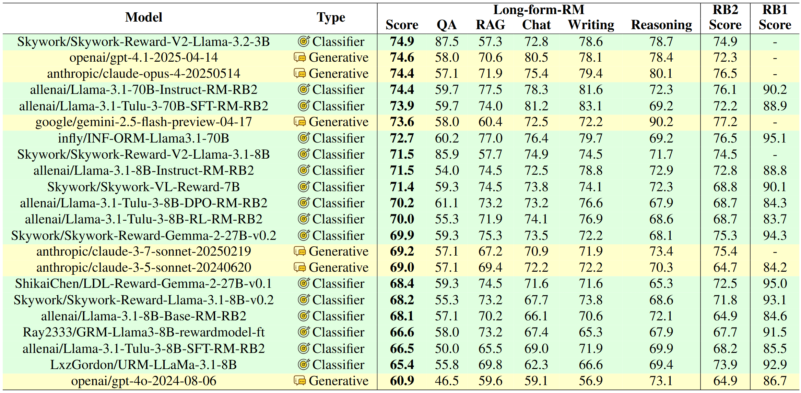

# Long-form Reward Model Benchmark

## Overview

This is the anonymous github repository for AAAI2026 submission: Long-form RewardBench: Evaluating Reward Models for Long-form Generation

Long-formRMB is a comprehensive benchmark designed to evaluate the performance of reward models in generating long-form content. This repository contains scripts and models for assessing various aspects of AI-generated responses.

## LeaderBoard



## Running the Evaluation

To run the evaluation scripts, you have to decide which kind of evaluation mode you want to use. 

Notice due to the different number of negative samples for reasoning subset, we had to splite the scripts into two parts.

### 1. API Mode

To evaluate API model, please use the following script. You have to choose one evaluation mode from "classification" and "selection". You also need an api key and a base url before that.

```bash
export OPENAI_API_KEY="your-api-key" # Set your openai api key here
export OPENAI_BASE_URL="your-base-url" # Set your openai base url here

MODEL_NAME="gpt-4o-0806" # Put your model name here
MODE="selection" # Set the mode as either selection or scoring

DATASET="./data/preference_data_bon.jsonl"
OUTPUT="./results/preference_data_bon_${MODEL_NAME}_${MODE}.jsonl"

python evaluation/infer_bon_api.py \
    --model_name $MODEL_NAME \
    --input_file $DATASET \
    --output_file $OUTPUT \
    --num_threads 10 \
    --infer_mode $MODE \
    --chosen_num 1 \
    --rejected_num 3

python evaluation/cal_accuracy_from_file.py \
    --input_file $OUTPUT \
    --infer_mode $MODE

MODE="selection"

DATASET="./data/preference_data_reasoning.jsonl"
OUTPUT="./results/preference_data_reasoning_${MODEL_NAME}_${MODE}.jsonl"

python evaluation/infer_bon_api.py \
    --model_name $MODEL_NAME \
    --input_file $DATASET \
    --output_file $OUTPUT \
    --num_threads 10 \
    --infer_mode $MODE \
    --chosen_num 1 \
    --rejected_num 1

python evaluation/cal_accuracy_from_file.py \
    --input_file $OUTPUT \
    --infer_mode $MODE
```

### 2. Classifier Mode

To evaluate sequence classifier model, please use the following script. Notice some of the classifiers can not be loaded directed by `AutoModelForSequenceClassification`, and we have adapted their loading method in `L18` of `infer_bon_cls.py`.

```bash
MODEL_NAME=Skywork-Reward-V2-Llama-3.1-8B # Put your model name here
MODEL=/home/hh456524/WorkSpace/TuningFactoryModels/RewardModels/Skywork-Reward-V2-Llama-3.1-8B # Put your model path here

DATASET="./data/preference_data_bon.jsonl"
OUTPUT="./results/preference_data_${MODEL_NAME}.jsonl"

python -u evaluation/infer_bon_cls.py \
    --model_path $MODEL \
    --input_file $DATASET \
    --output_file $OUTPUT \
    --chosen_num 1 \
    --rejected_num 3

python -u evaluation/cal_accuracy_from_file.py \
    --input_file $OUTPUT

DATASET="./data/preference_data_reasoning.jsonl" # Put your model name here
OUTPUT="./results/preference_data_reasoning_${MODEL_NAME}_${MODE}.jsonl" # Put your model path here

python -u evaluation/infer_bon_cls.py \
    --model_path $MODEL \
    --input_file $DATASET \
    --output_file $OUTPUT \
    --chosen_num 1 \
    --rejected_num 1

python -u evaluation/cal_accuracy_from_file.py \
    --input_file $OUTPUT
```

### 3. vllm model

To evaluate local generative model, please use the following script. You have to choose one evaluation mode from "classification" and "selection". 

```bash
MODEL_NAME=Selene-1-Mini-Llama-3.1-8B # Put your model name here
MODEL="/home/hh456524/WorkSpace/TuningFactoryModels/RewardModels/${MODEL_NAME}" # Put your model path here

DATASET="./data/preference_data_bon.jsonl"
OUTPUT="./results/preference_data_bon_${MODEL_NAME}.jsonl"

python -u evaluation/infer_bon_vllm.py \
    --model_path $MODEL \
    --input_file $DATASET \
    --output_file $OUTPUT \
    --chosen_num 1 \
    --rejected_num 3

python -u evaluation/cal_accuracy_from_file.py \
    --input_file $OUTPUT

DATASET="./data/preference_data_reasoning.jsonl"
OUTPUT="./results/preference_data_reasoning_${MODEL_NAME}.jsonl"

python -u evaluation/infer_bon_vllm.py \
    --model_path $MODEL \
    --input_file $DATASET \
    --output_file $OUTPUT \
    --chosen_num 1 \
    --rejected_num 1

python -u evaluation/cal_accuracy_from_file.py \
    --input_file $OUTPUT
```

## License

This project is licensed under the MIT License.
